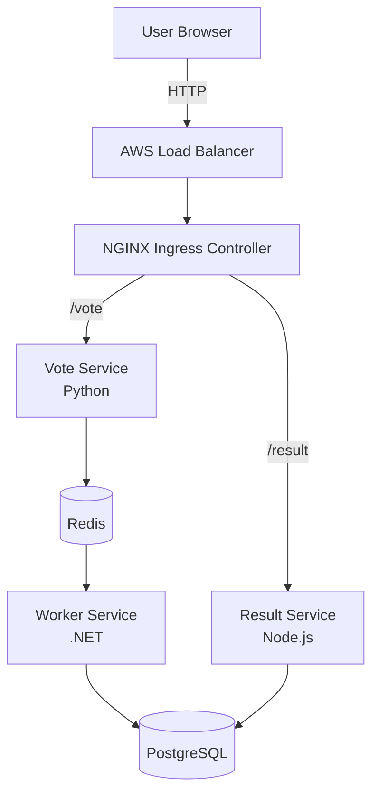

# 3-Tier Voting App on Amazon EKS

A production-like microservices voting application deployed on **Amazon EKS** with full **CI/CD** using GitHub Actions, NGINX Ingress Controller, Redis, and PostgreSQL.


---

## Project Overview

This project demonstrates a complete **cloud-native DevOps workflow**:

- Containerized microservices (Vote, Result, Worker)
- Orchestrated on **Amazon EKS** (Managed Kubernetes)
- Automated **CI/CD pipeline** with GitHub Actions
- Path-based routing using **NGINX Ingress Controller**
- Persistent data with **PostgreSQL** + **Redis**
- Secure configuration using **Kubernetes Secrets**

**Voting Flow:**
User → Vote App (Python) → Redis → Worker (.NET) → PostgreSQL → Result App (Node.js)


---

## Architecture

Internet
↓
AWS Network Load Balancer (created by NGINX Ingress)
↓
NGINX Ingress Controller
├── /vote   → Vote Service   (Python)
└── /result → Result Service (Node.js)
↑
PostgreSQL
↑
Worker (.NET)
↑
Redis


**Mermaid Diagram (renders on GitHub):**

**Mermaid Diagram (renders on GitHub):**


---
## Tech Stack

| Layer                    | Technology                  | Purpose                              |
|--------------------------|-----------------------------|--------------------------------------|
| Container Orchestration  | Amazon EKS (Kubernetes)     | Managed Kubernetes control plane     |
| Vote Service             | Python                      | Frontend for casting votes           |
| Result Service           | Node.js                     | Frontend for viewing live results    |
| Worker Service           | .NET                        | Background processor                 |
| Cache / Queue            | Redis                       | Temporary vote storage               |
| Database                 | PostgreSQL                  | Persistent vote storage              |
| Ingress                  | NGINX Ingress Controller    | Path-based routing (`/vote`, `/result`) |
| CI/CD                    | GitHub Actions              | Build → Push → Deploy automation     |
| Container Registry       | Docker Hub                  | Image storage                        |
| Cluster Provisioning     | eksctl                      | Easy EKS cluster creation            |
| Package Manager          | Helm                        | Install NGINX Ingress                |

---

## Features

- Fully containerized **3-tier microservices** architecture
- Automated **build, push, and deploy** using GitHub Actions
- Path-based routing (`/vote` and `/result`) via NGINX Ingress
- Kubernetes **Secrets** for sensitive data (DB credentials)
- Clean and modular Kubernetes manifests
- Service discovery via Kubernetes DNS (`redis-service`, `db`, etc.)
- Horizontal Pod Autoscaling ready
- Production-like setup on Amazon EKS
- Optional HTTPS with cert-manager + Let's Encrypt (addon)

---

## Prerequisites

- AWS Account with sufficient permissions (EKS, EC2, IAM, VPC)
- `eksctl`, `kubectl`, and `helm` installed locally
- Docker Hub account
- GitHub repository with Actions enabled
- AWS CLI configured (`aws configure`)

---

## Project Structure

```
.
├── .github/
│   └── workflows/
│       └── ci-cd-pipeline.yml       # GitHub Actions CI/CD
├── k8s/
│   ├── redis-deployment.yaml
│   ├── redis-service.yaml
│   ├── postgres-deployment.yaml
│   ├── postgres-service.yaml
│   ├── vote-deployment.yaml
│   ├── vote-service.yaml
│   ├── result-deployment.yaml
│   ├── result-service.yaml
│   ├── worker-deployment.yaml
│   ├── ingress.yaml
│   └── secrets.yaml                 # or create via kubectl
├── vote/                            # Python Vote app source
├── result/                          # Node.js Result app source
├── worker/                          # .NET Worker app source
└── README.md
```

---

## How to Deploy

### 1. Create the EKS Cluster

```bash
eksctl create cluster \
  --name voting-app-cluster \
  --region us-east-1 \
  --nodes 3 \
  --node-type t3.medium \
  --managed

Tip: Use --managed for managed node groups (recommended).
Cluster creation usually takes 15–20 minutes.
---
## Deployment Guide

### 1. Prerequisites

- An existing EKS (or other Kubernetes) cluster
- `kubectl`, `helm`, and `eksctl` installed and configured
- Docker Hub account (for CI/CD image pushes)

### 2. Create Kubernetes Secrets (Recommended)

```bash
kubectl create secret generic db-credentials \
  --from-literal=POSTGRES_USER=postgres \
  --from-literal=POSTGRES_PASSWORD=YourSecurePassword123!
```

Then reference them in your Deployment manifests:

```yaml
env:
  - name: POSTGRES_USER
    valueFrom:
      secretKeyRef:
        name: db-credentials
        key: POSTGRES_USER
  - name: POSTGRES_PASSWORD
    valueFrom:
      secretKeyRef:
        name: db-credentials
        key: POSTGRES_PASSWORD
```

### 3. Deploy Redis & PostgreSQL

```bash
kubectl apply -f k8s/redis-deployment.yaml
kubectl apply -f k8s/redis-service.yaml
kubectl apply -f k8s/postgres-deployment.yaml
kubectl apply -f k8s/postgres-service.yaml
```

### 4. Deploy the Microservices

```bash
kubectl apply -f k8s/vote-deployment.yaml
kubectl apply -f k8s/vote-service.yaml
kubectl apply -f k8s/result-deployment.yaml
kubectl apply -f k8s/result-service.yaml
kubectl apply -f k8s/worker-deployment.yaml
```

> **Important:** Microservices communicate using Kubernetes DNS names (e.g. `redis-service`, `db`, or `postgres-service`). Never hard-code IP addresses!

### 5. Install NGINX Ingress Controller (Helm)

```bash
helm repo add ingress-nginx https://kubernetes.github.io/ingress-nginx
helm repo update

helm install my-nginx ingress-nginx/ingress-nginx \
  --namespace ingress-nginx \
  --create-namespace
```

Verify:

```bash
kubectl get pods -n ingress-nginx
```

### 6. Create Ingress Resource

```bash
kubectl apply -f k8s/ingress.yaml
```

Example `ingress.yaml`:

```yaml
apiVersion: networking.k8s.io/v1
kind: Ingress
metadata:
  name: voting-app-ingress
  annotations:
    kubernetes.io/ingress.class: "nginx"
spec:
  rules:
    - http:
        paths:
          - path: /vote
            pathType: Prefix
            backend:
              service:
                name: vote-service
                port:
                  number: 80
          - path: /result
            pathType: Prefix
            backend:
              service:
                name: result-service
                port:
                  number: 80
```

### 7. Access the Application

```bash
kubectl get ingress
```

Wait until the `ADDRESS` field is populated (can take 1–5 minutes). Then open:

- **Vote app** → `http://<INGRESS_EXTERNAL_IP>/vote`
- **Result app** → `http://<INGRESS_EXTERNAL_IP>/result`

---

## CI/CD Pipeline (GitHub Actions)

The pipeline automatically:

1. Builds Docker images for `vote`, `result`, and `worker`
2. Pushes them to Docker Hub
3. Configures AWS credentials
4. Updates kubeconfig for the EKS cluster
5. Applies the Kubernetes manifests

**Trigger:** Push to the `main` branch (or manual `workflow_dispatch`)

### Required GitHub Secrets

| Secret Name | Description |
|---|---|
| `DOCKERHUB_USERNAME` | Your Docker Hub username |
| `DOCKERHUB_TOKEN` | Docker Hub access token |
| `AWS_ACCESS_KEY_ID` | AWS IAM access key |
| `AWS_SECRET_ACCESS_KEY` | AWS IAM secret key |

### Example Workflow Snippet

```yaml
- name: Configure AWS Credentials
  uses: aws-actions/configure-aws-credentials@v4
  with:
    aws-access-key-id: ${{ secrets.AWS_ACCESS_KEY_ID }}
    aws-secret-access-key: ${{ secrets.AWS_SECRET_ACCESS_KEY }}
    aws-region: us-east-1

- name: Update Kubeconfig
  run: |
    aws eks update-kubeconfig --name voting-app-cluster --region us-east-1

- name: Apply Kubernetes Manifests
  run: kubectl apply -f k8s/
```

---

## Validation & Demo Checklist

After the pipeline succeeds (or after manual deployment):

```bash
# Check Deployments
kubectl get deployments

# Check Pods
kubectl get pods

# Check Services
kubectl get svc

# Check Ingress
kubectl get ingress

# Check logs (example)
kubectl logs -l app=vote
kubectl logs -l app=worker
```

**End-to-end test:**

1. Open `/vote` and cast several votes
2. Open `/result` and watch the results update in real time
3. Confirm the flow: **Vote → Redis → Worker → PostgreSQL → Result**

---

## Project Add-ons

### HTTPS with cert-manager + Let's Encrypt

1. Install cert-manager
2. Create a `ClusterIssuer` for Let's Encrypt
3. Annotate your Ingress with the issuer
4. Point a Route 53 domain to the Ingress Load Balancer
5. Certificates will be issued and renewed automatically

### Horizontal Pod Autoscaler (HPA)

Ready to add:

```bash
kubectl autoscale deployment vote --cpu-percent=50 --min=2 --max=10
```

### Monitoring (optional)

- Prometheus + Grafana
- AWS CloudWatch Container Insights

---

## Troubleshooting

| Issue | Solution |
|---|---|
| Ingress `ADDRESS` stays `<pending>` | Wait 2–5 min or check AWS Load Balancer |
| Pods `CrashLoopBackOff` | Check logs + Secrets + environment variables |
| Services cannot reach Redis/DB | Verify Service names & DNS (same namespace) |
| CI/CD fails on kubeconfig | Ensure IAM user has EKS permissions |
| Images not updating | Use unique tags or `imagePullPolicy: Always` |

---

## Useful Commands Cheat Sheet

```bash
# Cluster
eksctl get cluster
kubectl get nodes

# Workloads
kubectl get all
kubectl describe pod <pod-name>
kubectl logs -f <pod-name>

# Cleanup
kubectl delete -f k8s/
eksctl delete cluster --name voting-app-cluster --region us-east-1
```

---

## Skills You Will Learn

- Managed Kubernetes (Amazon EKS)
- Container Orchestration with Deployments & Services
- Path-based routing with NGINX Ingress
- Kubernetes Secrets management
- GitHub Actions CI/CD for cloud-native apps
- Service discovery inside Kubernetes
- Production-ready microservices patterns

---

Good luck! This project gives you practical, end-to-end exposure to modern cloud-native DevOps workflows — from container builds all the way to automated deployment on Amazon EKS.

