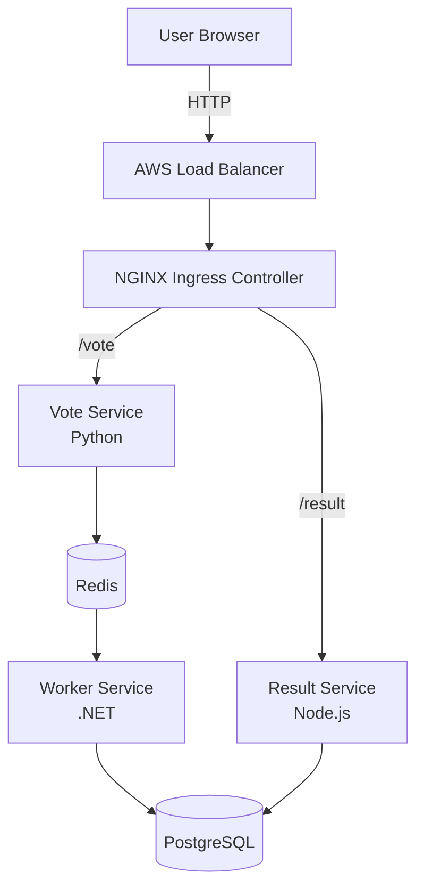

# 3-Tier Voting App on Amazon EKS

A production-like microservices voting application deployed on **Amazon EKS** with full **CI/CD** using GitHub Actions, NGINX Ingress Controller, Redis, and PostgreSQL.


---

## Project Overview

This project demonstrates a complete **cloud-native DevOps workflow**:

- Containerized microservices (Vote, Result, Worker)
- Orchestrated on **Amazon EKS** (Managed Kubernetes)
- Automated **CI/CD pipeline** with GitHub Actions
- Path-based routing using **NGINX Ingress Controller**
- Persistent data with **PostgreSQL** + **Redis**
- Secure configuration using **Kubernetes Secrets**

**Voting Flow:**
User → Vote App (Python) → Redis → Worker (.NET) → PostgreSQL → Result App (Node.js)


---

## Architecture

Internet
↓
AWS Network Load Balancer (created by NGINX Ingress)
↓
NGINX Ingress Controller
├── /vote   → Vote Service   (Python)
└── /result → Result Service (Node.js)
↑
PostgreSQL
↑
Worker (.NET)
↑
Redis


**Mermaid Diagram (renders on GitHub):**

**Mermaid Diagram (renders on GitHub):**


---
## Tech Stack

| Layer                    | Technology                  | Purpose                              |
|--------------------------|-----------------------------|--------------------------------------|
| Container Orchestration  | Amazon EKS (Kubernetes)     | Managed Kubernetes control plane     |
| Vote Service             | Python                      | Frontend for casting votes           |
| Result Service           | Node.js                     | Frontend for viewing live results    |
| Worker Service           | .NET                        | Background processor                 |
| Cache / Queue            | Redis                       | Temporary vote storage               |
| Database                 | PostgreSQL                  | Persistent vote storage              |
| Ingress                  | NGINX Ingress Controller    | Path-based routing (`/vote`, `/result`) |
| CI/CD                    | GitHub Actions              | Build → Push → Deploy automation     |
| Container Registry       | Docker Hub                  | Image storage                        |
| Cluster Provisioning     | eksctl                      | Easy EKS cluster creation            |
| Package Manager          | Helm                        | Install NGINX Ingress                |

---

## Features

- Fully containerized **3-tier microservices** architecture
- Automated **build, push, and deploy** using GitHub Actions
- Path-based routing (`/vote` and `/result`) via NGINX Ingress
- Kubernetes **Secrets** for sensitive data (DB credentials)
- Clean and modular Kubernetes manifests
- Service discovery via Kubernetes DNS (`redis-service`, `db`, etc.)
- Horizontal Pod Autoscaling ready
- Production-like setup on Amazon EKS
- Optional HTTPS with cert-manager + Let's Encrypt (addon)

---

## Prerequisites

- AWS Account with sufficient permissions (EKS, EC2, IAM, VPC)
- `eksctl`, `kubectl`, and `helm` installed locally
- Docker Hub account
- GitHub repository with Actions enabled
- AWS CLI configured (`aws configure`)

---

## Project Structure

├── .github/
│   └── workflows/
│       └── ci-cd-pipeline.yml          # GitHub Actions CI/CD
├── k8s/
│   ├── redis-deployment.yaml
│   ├── redis-service.yaml
│   ├── postgres-deployment.yaml
│   ├── postgres-service.yaml
│   ├── vote-deployment.yaml
│   ├── vote-service.yaml
│   ├── result-deployment.yaml
│   ├── result-service.yaml
│   ├── worker-deployment.yaml
│   ├── ingress.yaml
│   └── secrets.yaml                    # or create via kubectl
├── vote/                               # Python Vote app source
├── result/                             # Node.js Result app source
├── worker/                             # .NET Worker app source
└── README.md

---

## How to Deploy

### 1. Create the EKS Cluster

```bash
eksctl create cluster \
  --name voting-app-cluster \
  --region us-east-1 \
  --nodes 3 \
  --node-type t3.medium \
  --managed

Tip: Use --managed for managed node groups (recommended).
Cluster creation usually takes 15–20 minutes.

---

### 2. Create Kubernetes Secrets
kubectl create secret generic db-credentials \
  --from-literal=POSTGRES_USER=postgres \
  --from-literal=POSTGRES_PASSWORD=YourSecurePassword123!

Then reference them in your Deployment manifests:


